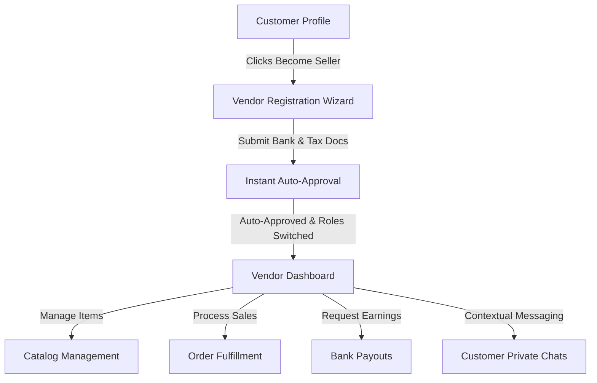

# Sikh Street Vendor System - Beginner's Guide & Developer Documentation

Welcome to the **Sikh Street Vendor Marketplace System**! This documentation details the design, architecture, and step-by-step usage guide for the multi-vendor features, role switches, catalog control, payouts, and private messaging systems.

---

## 📌 Project Overview
Sikh Street is a gamified, multi-country e-commerce marketplace. The system allows regular customers to transition into **Artisan Sellers** (Vendors) to manage their inventories, process orders, request bank payouts, and chat privately with buyers.



---

## 🚀 Beginner's Quick Start Demo Guide

To demonstrate the full vendor onboarding and dashboard lifecycle, follow these simple steps:

### Step 1: Start the Local Server
Verify that you are running the Vite development server:
```bash
npm run dev
```
Open the link displayed in the terminal (usually `http://localhost:5173`).

### Step 2: The Seller Onboarding Flow
1. By default, you enter the store as a **Customer**. You will see the **Become a Seller** button in the top right navbar.
2. Click **Become a Seller** to launch the **Artisan Seller Registration Wizard**.
3. **Fill out the 3-step form**:
   * **Step 1 (Profile)**: Enter your brand name, owner details, contact email/phone, category, and origin country.
   * **Step 2 (Documents)**: Click the boxes to upload simulated business licenses and national IDs (simulates an HMR upload progress bar).
   * **Step 3 (Payouts)**: Enter bank name, account number, routing code, and check the Ethics Agreement.
4. Click **Submit Registration**. Your shop is automatically approved and registered into `localStorage` state, and the app redirects you directly to your new **Vendor Dashboard**.

### Step 3: Switch Between Roles (Demo Toggle)
* To switch back to customer view to buy items or chat, click the **User Dropdown** (top-right, shows profile avatar) and select **Customer View** (or click the **Back to Shop** button).
* Once registered, when you are in the customer view, you will see a **Seller Portal** button in the header. Click it to return to your dashboard instantly.

---

## ⚙️ Core Vendor Functionalities

The Vendor Dashboard (`src/pages/VendorDashboard.jsx`) consists of five main panels:

### 1. Business Overview (`Overview Tab`)
* **Key Stats Counters**: Real-time updates for:
  * **Total Earnings**: Gross revenue generated by your store.
  * **Total Orders**: Number of purchases made for your products.
  * **Products Listed**: Active catalog counts.
  * **Average Rating**: Rating calculated from customer feedback.
* **Monthly Sales Chart**: Interactive bar charts mapping historical payouts and sales.
* **Store Switcher**: Demo utility allowing you to toggle views between pre-loaded mock vendors (e.g. *Khalsa Steel Crafts*, *Amritsar Turban House*) to review their respective payouts, orders, and chats.

### 2. Catalog Control (`Catalog Tab`)
* **Listing New Products**: Click **Add New Product** to open the creation card. Set the title, price (USD), description, material, dimensions, design style, and category.
* **Quick Stock Modifier**: Adjust stock quantities instantly using simple `+` and `-` controls.
* **Edit/Delete Actions**: Modify existing product details or delete outdated listings from the catalog immediately.

### 3. Order Fulfillment (`Orders Tab`)
* **Order Tracking**: Review purchase orders showing the customer's name, destination country (multi-country operations), purchase quantity, and order date.
* **Status Processing**: Transition orders from **Pending** to **Shipped** or **Cancelled** to update the checkout statuses in real time.

### 4. Bank Payouts (`Payouts Tab`)
* **Earnings Wallet**: Displays your net earnings (sales minus standard **5% platform commission**).
* **Instant Payout Request**: Submit request forms specifying bank accounts to withdraw funds.
* **Payout History**: Lists previous withdrawals (Status: *Completed* or *Processing*) with tracking codes.

### 5. Private Customer Chats (`Customer Chats Tab`)
* **Contextual Conversations**: Secure buyer-seller inbox where conversations are kept private to the respective vendor and buyer.
* **Dual-Panel Messenger**:
  * **Left Side**: Inbox listing active buyer threads with unread indicators.
  * **Right Side**: Full chat bubble transcript and interactive reply form.

---

## 🛠️ Developer Technical Architecture

The Vendor System relies on global React state coordinates defined in `src/context/AppContext.jsx`:

### 1. Key State Variables
* `isRegisteredSeller` *(boolean)*: Persists registration status in local storage. Controls header UI buttons.
* `selectedVendor` *(string)*: Tracks which vendor profile is active in the dashboard.
* `products` *(array)*: Holds the catalog items, allowing dynamic adding, editing, and deleting.
* `orders` *(array)*: Holds active and historical purchase orders.
* `messages` *(array)*: Global database of messaging packets (stores sender, receiver, text, and timestamp details).

### 2. File Directory Mapping
* [Navbar.jsx](file:///c:/Users/91735/Sikh---Store/src/components/Navbar.jsx): Controls role toggle CTAs, profile menu avatars, and restricts portal access.
* [VendorRegistration.jsx](file:///c:/Users/91735/Sikh---Store/src/pages/VendorRegistration.jsx): Multi-step registration wizard with auto-approval logic.
* [VendorDashboard.jsx](file:///c:/Users/91735/Sikh---Store/src/pages/VendorDashboard.jsx): Main control hub containing sub-tab panel components (Overview, Catalog, Orders, Payouts, Chats).
* [InventoryManagement.jsx](file:///c:/Users/91735/Sikh---Store/src/pages/InventoryManagement.jsx): Standalone screen for quick-access bulk stock modifications.

---

## 🛡️ Security & Privacy Notice
Unlike general broadcast message systems, client-vendor communications are strictly private. 
* Customers contact vendors directly from individual product listings.
* Messages are routed using target vendor brand values (`receiver`) and customer profile names (`sender`).
* Vendors only see conversation channels corresponding to their selected active shop profile.
